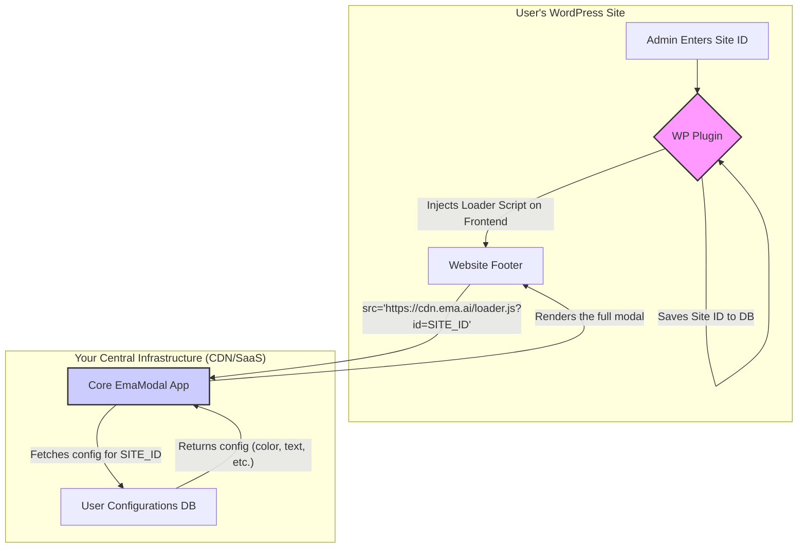

# Advanced Architecture: EmaModal as a Centralized Service (SaaS)

While the self-contained plugin model is robust and standard for WordPress, a more scalable and maintainable architecture exists for when you plan to offer `EmaModal` as a service to many clients. This model decouples the core application from the user's WordPress installation.

The WordPress plugin becomes a lightweight **loader**, and the `EmaModal` React application is hosted centrally on a high-performance Content Delivery Network (CDN).

---

### The Core Idea

Instead of packaging the entire React application inside the plugin, the plugin only does two things:

1.  Provides a simple settings page for the user to enter a unique **Site ID** or **API Key**.
2.  Injects a single `<script>` tag into the site's footer that loads the main application from your central server.

This means you can push updates, fix bugs, and add features to the `EmaModal` application, and **every user gets the update instantly** without having to update their plugin.

---

### Architectural Diagram

This diagram illustrates the decoupled flow:



---

### Components of the SaaS Model

#### 1. The WordPress "Loader" Plugin

The plugin becomes incredibly simple. Its `ema-modal-plugin.php` file is minimal.

**Key PHP Functions:**

- **Admin Page**: A settings page with a _single field_ for the "Site ID" or "API Key" you provide to your customer.
- **Script Enqueue**: A function that injects the loader script.

Here is what the script enqueueing part might look like in your `ema-modal-plugin.php`:

```php
function ema_saas_enqueue_loader_script() {
    if ( is_admin() ) {
        return;
    }

    $options = get_option( 'ema_modal_settings' );
    $site_id = isset( $options['site_id'] ) ? $options['site_id'] : '';

    if ( empty( $site_id ) ) {
        return; // Don't load anything if no ID is set.
    }

    // The URL to your centrally hosted loader script
    $loader_script_url = 'https://cdn.ema.ai/v1/loader.js';

    // Append the site ID as a query parameter
    $url_with_id = add_query_arg( 'id', $site_id, $loader_script_url );

    // Enqueue the script
    wp_enqueue_script(
        'ema-modal-loader',
        $url_with_id,
        [], // No dependencies
        null, // No version needed, handled by your server
        true  // Load in footer
    );
}
add_action( 'wp_enqueue_scripts', 'ema_saas_enqueue_loader_script' );

// We also need a root element, but this can even be generated by the loader script itself.
function ema_saas_add_root_element() {
    if ( ! is_admin() ) {
        echo '<div id="ema-modal-root"></div>';
    }
}
add_action( 'wp_footer', 'ema_saas_add_root_element' );
```

#### 2. The Central "Core" Application

This is your main React application, built and hosted on a service like Vercel, Netlify, or AWS S3 + CloudFront.

- **`loader.js`**: This is the entry point script. When it runs on the user's site, it reads the `id` from its own script tag's URL.
- **Configuration Fetching**: The script then makes an API call to your backend (`https://api.ema.ai/config?id=...`) to get the specific configuration for that user (the `emaUrl`, `themeColor`, etc.).
- **Rendering**: Once it has the configuration, it mounts and renders the full `EmaModal` React component into the `#ema-modal-root` div on the user's page.

---

### Comparison: Self-Contained Plugin vs. SaaS Model

| Feature             | Self-Contained Plugin                                     | Decoupled SaaS Model                                                 |
| ------------------- | --------------------------------------------------------- | -------------------------------------------------------------------- |
| **Updates**         | User must manually update the plugin to get new features. | **Instant.** You deploy once, everyone gets the update.              |
| **Maintenance**     | Low. No servers to manage.                                | Higher. Requires managing a separate hosted application.             |
| **User Experience** | Good. User configures settings in WP admin.               | **Excellent.** User only needs to enter a single ID.                 |
| **Performance**     | Dependent on user's hosting.                              | Potentially faster, served from a global CDN.                        |
| **Reliability**     | High. No external dependencies.                           | **External Dependency.** If your service is down, the modal is down. |
| **Complexity**      | Moderate. Requires knowledge of both WP and React.        | High. Requires frontend, backend, and infrastructure skills.         |
| **Monetization**    | Difficult. One-time sale.                                 | **Easy.** Ideal for subscription-based (SaaS) billing.               |

---

### Conclusion

For distributing a free or open-source tool, the **self-contained plugin** is simpler and perfectly adequate.

For a commercial product where you want to provide ongoing service, easy updates, and a scalable subscription model, the **decoupled SaaS architecture** is the superior professional approach. It offers the best experience for the end-user (just enter a key) and the most control and agility for you as the developer.
